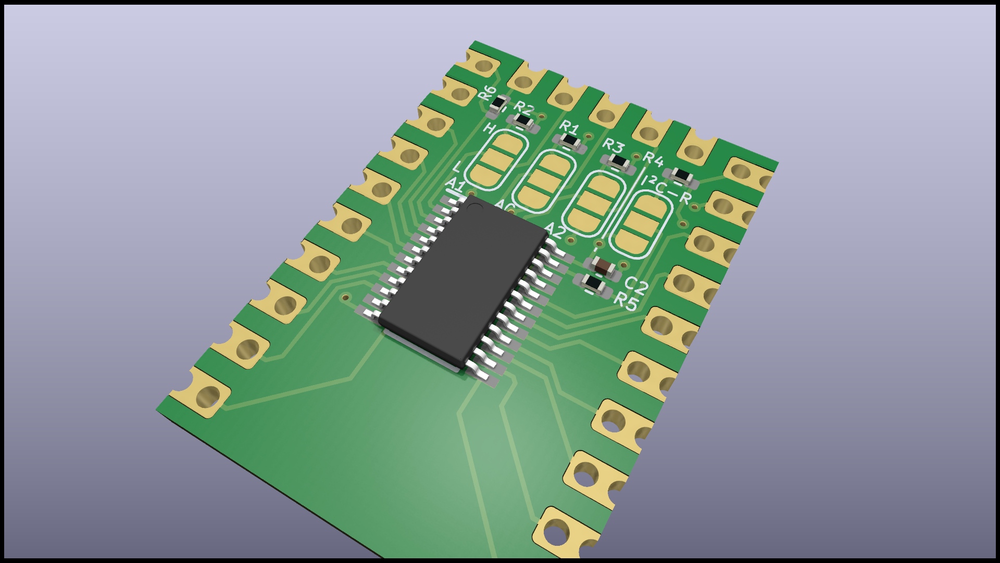
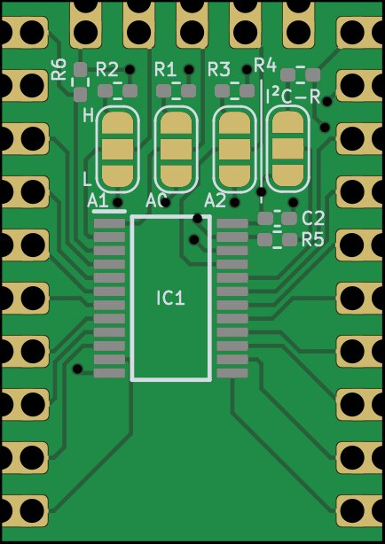

# I²C Multiplexer

Simple PCB based on TCA9548APWR. Castellated holes with secondary pin header holes are added, for direct PCB soldering. Secondary pin header holes are placed in a matrix of 2,54 mm (100 mils).

## Features

* Solder pads for I²C address
* Solder pads for I²C Pull-Up Resistor
